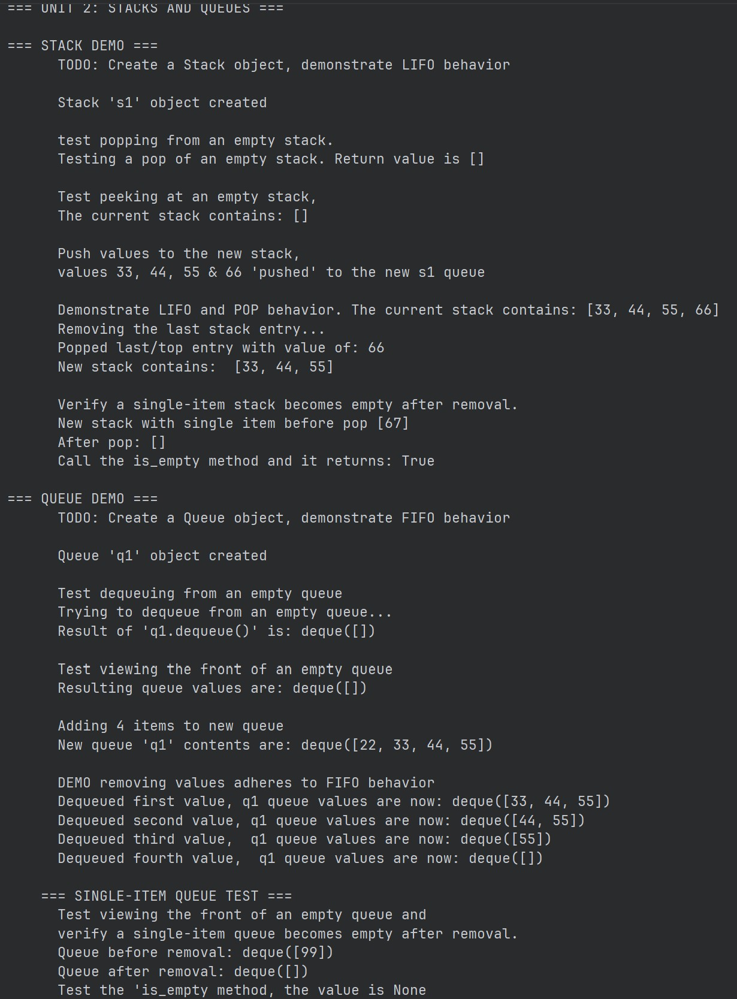

# IMPLEMENTATION DOCUMENTATION

## Unit 2 Discussion: Stacks and Queues

## Overview

This assignment explores how data structure are used for implementing both stacks and queues. 

## Implementation

elements although the consumer of the custom Stack and Queue classes does not need to be aware of this.

## Sample Output

