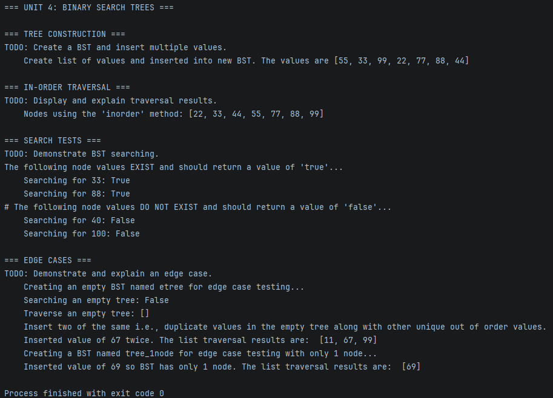

# Unit 4 Discussion: Binary Search Trees

## Overview

This assignment introduces Binary Search Trees (BSTs) and recursive tree operations.

## Learning Objectives

- Build a BST
- Insert values recursively
- Search recursively
- Perform in-order traversal
- Understand BST organization

## Requirements

1. Build a BST.
2. Insert multiple values.
3. Demonstrate in-order traversal.
4. Test searching.
5. Demonstrate edge cases.
6. Create a real-world BST example.

## Structure and Approach

Before beginning any pseudocode or code logic planning in general, it was necessary for me to go back and review the traversal logic for both searching and listed node values. Once I had a better understanding of how and why the zyBooks examples worked for traversing a binary search tree, the rest of the code was less of a challenge by comparison. After the classes were created, each method was created and tested individually while working in parallel on the main method.

## Output from Week 4 Code Assignment

