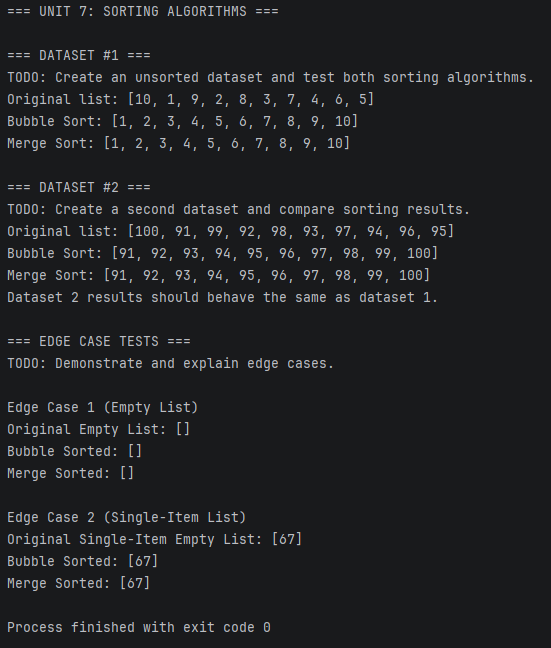

# Unit 7 Discussion: Sorting Algorithms

## Overview

This assignment compares Bubble Sort and Merge Sort.

## Learning Objectives

- Implement Bubble Sort
- Implement Merge Sort
- Understand divide-and-conquer
- Compare algorithm efficiency

## Requirements

1. Test Bubble Sort and Merge Sort.
2. Use multiple datasets.
3. Demonstrate edge cases.
4. Analyze performance.
5. Create a real-world sorting example.

## Structure and Approach

With this week's assignment, sorting algorithms were created for both bubble and merge sorting using 2 different data sets. The merge method calls a helper method recursively that perform the actual sorting of data set elements.

In addition, edge cases were created to test sorting on both algorithms for an empty data set as well as a data set with only one element.

Both data sets for the initial bubble and merge sorting were created with the original element as out of order as possible as to stress test the algorithm logic as much as possible.

## OUTPUT

