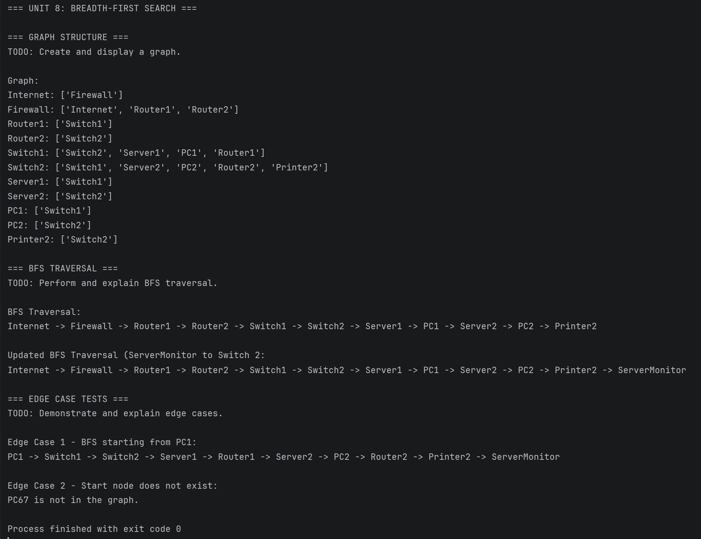

# Unit 8 Discussion: Breadth-First Search (BFS)

## Overview

This assignment explores graph traversal using Breadth-First Search (BFS).

## Learning Objectives

- Represent graphs using adjacency lists
- Implement BFS
- Use queues in graph traversal
- Analyze graph traversal behavior

## Requirements

1. Create a graph.
2. Perform BFS traversal.
3. Add nodes or edges.
4. Demonstrate edge cases.
5. Analyze BFS behavior.
6. Create a real-world graph example.

## Structure and Approach

With this week's assignment, a graph was traversed using Breadth-First Search (BFS). For my graph table, I chose something I am familiar with, a network environment. My map is as follows (without edge cases):

                Internet
                   |
|------------Firewall-------------|
|                                 |
Router1  -- Switch1 -- Switch2 -- Router2
|           |
|           |-- Server2
|-- Server1 |-- PC2
|-- PC1     |-- Printer2

The BFS method logic was taken from what we learned in class this week and basic testing with just a few nodes was performed before creating the full blown TODO items to create and traverse a graph. Edge cases were chosen from our suggestion list and include starting from specific node as well as starting from a non-existent node.

## OUTPUT

